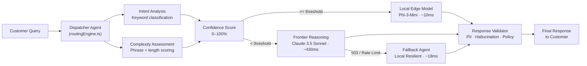

# RouteAI — Adaptive AI Customer Support

> A multi-agent customer support system that dynamically routes queries to the right AI model based on real-time complexity analysis and confidence scoring.

    

---

## Overview

RouteAI is an intelligent customer-support simulation platform that demonstrates how modern AI infrastructure can make real-time decisions about which model to use for each incoming query — instead of blindly sending everything to the most expensive frontier model.

The system analyses every customer message for intent, complexity, and routing confidence, then dispatches it to the most appropriate agent. When the premium API fails, the system automatically activates a fallback route and continues serving customers without interruption.

---

## The Problem

Most AI customer-support systems use a single model for every query:

- **Over-engineering simple requests**: _"What are your support hours?"_ goes to a \$0.03/call frontier model when it doesn't need to.
- **Under-engineering complex ones**: Billing disputes and enterprise SSO issues get routed to a fast local model that lacks the reasoning depth to resolve them.
- **No fault tolerance**: A single API outage takes the entire support desk offline.

---

## The Solution

RouteAI acts as a **smart dispatcher** that analyses each query before routing it:

| Signal | How it's measured |
|---|---|
| **Intent** | Keyword-weighted classification (billing, technical, security, account, policy, FAQ) |
| **Complexity** | Multi-clause phrase detection + query length scoring |
| **Confidence** | Composite score from intent strength and complexity |
| **Threshold** | User-configurable cut-off (50–95%) — queries above go local, below go to frontier model |
| **Fallback** | If the frontier API returns 503, the circuit breaker trips and routes to the local fallback agent |

---

## Architecture



---

## Key Features

- **🔀 Real-time model routing** — every query is scored and dispatched in < 5 ms of simulated analysis
- **📊 Live telemetry dashboard** — animated charts showing cost per query, latency distribution, and routing split over time
- **⚡ Confidence threshold control** — drag the slider to see how routing decisions change live
- **🔴 Failure simulation** — toggle a 503 outage on the premium API and watch the fallback circuit breaker trip in real-time
- **🖥️ Dispatcher trace panel** — see every analysis step (tokenization → intent → complexity → confidence → dispatch) with millisecond timing
- **🎛️ Operations console aesthetic** — designed to look like infrastructure tooling, not a generic AI chatbot UI

---

## Tech Stack

| Layer | Technology |
|---|---|
| Framework | React 18 + TypeScript 5.6 |
| Build tool | Vite 6 |
| Styling | Tailwind CSS 3 (custom `ops.*` design tokens) |
| Icons | Lucide React |
| Utilities | clsx + tailwind-merge |
| Fonts | Inter (UI) + JetBrains Mono (telemetry) |

> **No backend required.** All routing logic and responses are simulated client-side. No API keys needed to run the project.

---

## Project Structure

```
routeai/
├── index.html                      # App entry point (loads Google Fonts)
├── package.json
├── vite.config.ts
├── tsconfig.json
├── tailwind.config.js
├── postcss.config.js
│
└── src/
    ├── App.tsx                     # Root layout — wires all sections together
    ├── main.tsx                    # React DOM mount
    ├── index.css                   # Global styles + custom scrollbar
    │
    ├── types/
    │   └── index.ts                # Shared TypeScript types (RouteDecision, SystemConfig, …)
    │
    ├── services/
    │   ├── routingEngine.ts        # Core routing logic: analyzeRequest(), validateResponse()
    │   ├── responseGenerator.ts    # Generates realistic markdown responses per agent type
    │   └── telemetryStore.ts       # Singleton telemetry store with subscriber pattern
    │
    ├── data/
    │   └── presetQueries.ts        # 4 example queries spanning different intent/complexity pairs
    │
    └── components/
        ├── layout/
        │   ├── Header.tsx              # Nav bar + active section indicator
        │   ├── LiveBackground.tsx      # Canvas particle animation
        │   └── SystemStatusBar.tsx     # Cluster node health strip
        │
        ├── hero/
        │   └── HeroSection.tsx         # Headline + single CTA
        │
        ├── diagram/
        │   └── LiveRoutingDiagram.tsx  # Animated SVG topology of the routing pipeline
        │
        ├── desk/
        │   ├── SupportDesk.tsx         # Three-panel support desk container
        │   ├── ConversationPanel.tsx   # Chat UI + preset query chips
        │   ├── IntelligencePanel.tsx   # Decision metadata + confidence meter
        │   ├── RoutingControls.tsx     # Threshold slider + failure simulation toggle
        │   └── FailureSimulator.tsx    # (legacy — superseded by RoutingControls)
        │
        └── analytics/
            ├── RoutingEconomics.tsx    # Cost + latency economics section
            └── TelemetryCharts.tsx     # SVG sparkline charts (cost, latency, volume)
```

---

## Getting Started

### Prerequisites

- Node.js ≥ 18
- npm ≥ 9

### Installation

```bash
git clone https://github.com/YOUR_USERNAME/routeai.git
cd routeai
npm install
```

### Running locally

```bash
npm run dev
```

Open [http://localhost:5173](http://localhost:5173) in your browser.

### Building for production

```bash
npm run build
npm run preview        # preview the production build locally
```

---

## Environment Variables

RouteAI runs entirely in the browser — no backend, no API keys.

If you extend it with a real API proxy, copy `.env.example` to `.env` and fill in the values:

```bash
cp .env.example .env
```

See [`.env.example`](.env.example) for all available variables.

---

## How the Routing Engine Works

The core routing logic lives in [`src/services/routingEngine.ts`](src/services/routingEngine.ts).

### 1. Intent classification

The dispatcher scores each query against six intent categories using keyword-weighted matching:

| Intent | Example signals |
|---|---|
| `billing` | refund, invoice, charged twice, credit card |
| `technical` | api, sdk, saml, webhook, 503, curl |
| `security` | breach, 2fa, unauthorized, CVE |
| `account` | password, login, reset, profile |
| `policy` | SLA, GDPR, HIPAA, enterprise tier |
| `general_faq` | support hours, contact, documentation |

### 2. Complexity scoring

Phrase matching assigns complexity points:

- **+3pts** — `"even though"`, `"charged twice"`, `"dispute"`, `"unauthorized"`, `"aadsts"`
- **+1.5pts** — `"how can i"`, `"difference between"`, `"pricing tier"`
- **+1pt** — query length > 80 characters
- **+2pts** — multiple question marks (multi-part queries)

Result: `low` (< 1.5), `medium` (1.5–3.5), `high` (≥ 3.5).

### 3. Confidence calculation

```
base = high_complexity → 64–76%
       medium_complexity → 82–88%
       low_complexity → 91–98%

confidence = clamp(base, 45, 99)
```

### 4. Route selection

```
confidence >= threshold  →  local_faq  (fast, cheap)
confidence <  threshold  →  premium_reasoning  (slower, accurate)
```

If `simulateFailure` is enabled and the selected agent is `premium_reasoning`:

```
premium_reasoning  →  fallback_agent  (circuit breaker trips, amber banner shown)
```

---

## Fallback System

The fallback design follows a **circuit breaker pattern**:

1. A 503/rate-limit condition is detected on the premium agent.
2. The circuit trips to `fallback_agent` — the local resilient model.
3. Every subsequent complex query routes to fallback until the circuit is manually reset.
4. The UI shows a persistent amber outage banner and the fallback cascade counter increments.
5. Customers receive a response within ~18 ms with no service interruption.

---

## Demo Walkthrough

1. **Open the Support Desk** — click the _Support Desk_ tab in the header.
2. **Send a simple query** — select _"What are your support hours?"_ → watch it route to **Local Edge Model** at 91%+ confidence.
3. **Send a complex query** — select _"Refund dispute — eligible even though rejected"_ → routes to **Frontier Reasoning Agent** at ~71% confidence.
4. **Adjust the threshold** — drag the slider to 90% → the refund query now also escalates to premium reasoning.
5. **Simulate a 503 outage** — toggle _Simulate API Outage_ → resend a complex query → fallback circuit trips, amber banner appears.
6. **View economics** — scroll to the _Routing Economics_ section to see live cost and latency charts.

---

## Future Improvements

- [ ] Real backend proxy with actual Gemini / Anthropic API calls
- [ ] Persistent conversation history (IndexedDB or localStorage)
- [ ] Multi-turn context handling in the routing decision
- [ ] Webhook integration to receive queries from external ticketing systems (Zendesk, Linear)
- [ ] Authentication layer for multi-tenant support desk configuration
- [ ] Export telemetry to CSV / JSON
- [ ] Dark/light theme toggle

---

## Contributing

See [CONTRIBUTING.md](CONTRIBUTING.md) for guidelines on how to set up a local development environment, the branching strategy, and how to submit pull requests.

---

## License

See the [LICENSE](LICENSE) file for details.
